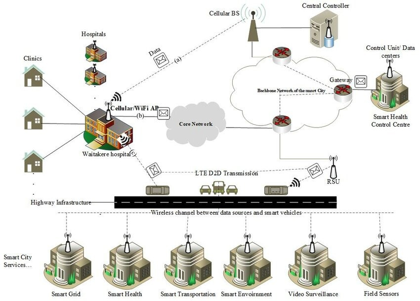
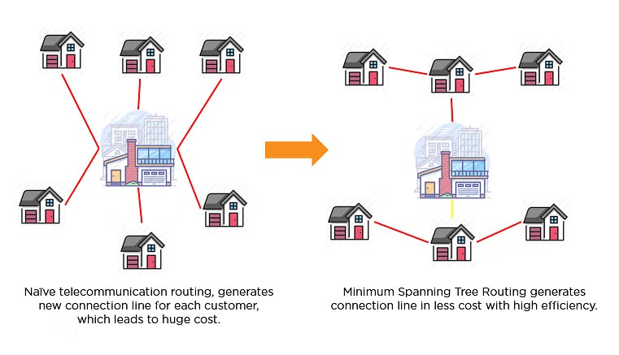
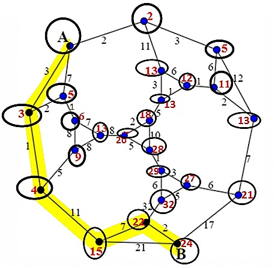

## Algorithmic Problem Solving Portfolio

<dl>
<dt>Course Name</dt>
<dd>Algorithmic Problem Solving</dd>
<dt>Course Code</dt>
<dd>23ECSE309</dd>
<dt>Name</dt>
<dd>Santoshi Vajrangi</dd>
<dt>SRN</dt>
<dd>01FE21BCS298</dd>
<dt>Course Instructor</dt>
<dd>Prakash Hegade</dd>
<dt>University</dt>
<dd>KLE Technological University, Hubballi-31</dd>
 
</dl>

***

#### Note:
This page hosts:

1. [Introduction](#introduction)
2. [Why Portfolio](#why-portfolio)
3. [Objectives](#objectives)
4. [Design](#SystemDesign)
5. [Business Use Cases](#Business-Use-Cases)
6. [References](#Refences)

* * *

### Prerequisites
* loren ipsum

* * *

## Introduction 

 The concept of a smart city revolves around leveraging advanced algorithms and cutting-edge technologies to enhance the efficiency, sustainability, and quality of life in urban areas. By integrating information and communication technologies (ICT) with the Internet of Things (IoT), smart cities aim to optimize city operations, provide better public services, and create a more sustainable environment. Algorithms play a pivotal role in processing the vast amounts of data generated by various sensors and devices, enabling intelligent decision-making and automation across different urban domains.

**Market Analysis**
The market for smart cities is rapidly growing, driven by urbanization, the need for efficient resource management, and the desire to improve the living standards of citizens. According to market research, the global smart city market is expected to reach $820.7 billion by 2025, growing at a compound annual growth rate (CAGR) of 14.8% from 2020 to 2025. This growth is fueled by investments in smart infrastructure, advancements in IoT and AI technologies, and increasing government initiatives for sustainable urban development

## Why Portfolio 

Creating a portfolio project for my Algorithmic Problem Solving course, focusing on implementing or simulating an ad suggestion mechanism, offers several advantages:

1. **Application of DSA Concepts**
2. **Problem-Solving Practice**
3. **Algorithm Optimization**
4. **Data Handling Skills**
5. **Interdisciplinary Application**
6. **Step to becoming a better engineer and a problem solver**
7. **Portfolio Enhancement**

## Objectives 
By the end of this portfolio project, I aim to accomplish the following objectives:

- **Algorithm Application and Design**: Explore and apply various algorithms suitable for smart city applications. such as traffic management, waste management, energy monitoring, and public safety to enhance my algorithmic problem-solving skills. Design and present these algorithms, possibly going beyond to solve real-world urban problems effectively.
- **Understanding Smart City Concepts**: Gain a comprehensive understanding of what constitutes a smart city, including the integration of ICT and IoT technologies to improve urban living.
- **Market Analysis and Relevance**: Conduct a thorough market analysis to understand the current trends, challenges, and opportunities in the smart city domain. Demonstrate the economic and societal benefits of implementing smart city solutions.
- **Critical Thinking and Analysis**:Critically evaluate why certain algorithms work better than others for specific smart city applications, providing a rationale for algorithm selection and demonstrating a deep understanding of algorithmic principles.
- **Enhance Public Safety Mechanisms**: Design and implement algorithms for advanced surveillance and incident detection to improve public safety and emergency response systems.
- **Sustainable Development**: Promote sustainable practices by reducing resource consumption and minimizing environmental impact.

## System Design 

  
 Designing a smart city using data structures and algorithms (DSA) involves creating a highly efficient and responsive urban environment by leveraging advanced computational techniques. The transportation system, for example, can be optimized using graph data structures to model the city's road network, with algorithms like Dijkstra's or A* finding the shortest paths to reduce congestion. Real-time traffic updates and emergency vehicle routing are managed through priority queues, while dynamic programming helps predict and mitigate traffic jams.

  

   Utility management, including water and electricity, uses graph representations of distribution networks and sensor networks for real-time monitoring. Dynamic programming algorithms optimize resource allocation and predict future usage patterns, ensuring efficient and reliable service delivery. Public safety systems utilize graphs to model the city's layout, facilitating rapid emergency response through optimal routing, while priority queues handle the prioritization of emergency calls. Additionally, dynamic programming predicts crime hotspots, allowing for effective allocation of law enforcement resources. Smart buildings and infrastructure are monitored and controlled using IoT networks and graph-based models, ensuring efficient maintenance and emergency management. This integrated approach, supported by robust DSA, enhances the overall quality of urban life by making city services more efficient, adaptive, and responsive to residents' needs.
  

 
 
## Business Use Cases for Smart Cities 

 
## 1. Traffic Management Systems
Smart traffic management systems use sensors and real-time data analytics to monitor and control traffic flow, reduce congestion, and enhance road safety. They rely on technologies such as cameras, IoT devices, and machine learning to gather and analyze data, allowing for dynamic traffic signal adjustments and real-time route recommendations.

- **Challenges**: Integrating data from multiple sources, real-time decision-making, handling peak traffic loads.
- **Market Benefits**: Reduced travel time, decreased fuel consumption, improved traffic safety.
- **Algorithms and performance Analysis**:
  - **Dijkstra's Algorithm**: For route optimization.
    - *Time Complexity*: O(V^2) or O(E + V log V) with a priority queue, where V is the number of vertices and E is the number of edges.
    - *Space Complexity*: O(V), for storing the shortest path tree.
    - [View code here](https://github.com/Santoshi-Vajrangi/aps-portfolio/blob/main/codes/Dijkstras.cpp)
  - **A* Algorithm**: For enhanced route optimization with heuristics.
    - *Time Complexity*: O(E), where E is the number of edges.
    - *Space Complexity*: O(V), for storing the open and closed lists.
    - [View code here](https://github.com/Santoshi-Vajrangi/aps-portfolio/blob/main/codes/A*.cpp)

## 2. Waste Management Optimization
IoT-enabled waste management systems optimize collection routes and schedules based on real-time data from smart bins, reducing operational costs and improving efficiency. These systems use sensors in bins to monitor fill levels and predict the optimal times for collection.

- **Challenges**: Ensuring sensor accuracy, efficient route optimization, handling diverse waste types.
- **Market Benefits**: Reduced operational costs, increased efficiency, improved environmental impact.
- **Algorithms and performance Analysis**:
  - **Greedy Algorithm**: For route optimization in waste collection.
    - *Time Complexity*: O(n log n), where n is the number of bins.
    - *Space Complexity*: O(n), for storing the sorted bins.
    -  [View code here](https://github.com/Santoshi-Vajrangi/aps-portfolio/blob/main/codes/greedy.cpp)
  - **K-Means Clustering**: For bin clustering and route optimization.
    - *Time Complexity*: O(n * k * t), where n is the number of bins, k is the number of clusters, and t is the number of iterations.
    - *Space Complexity*: O(n), for storing cluster assignments.
    - [View code here](https://github.com/Santoshi-Vajrangi/aps-portfolio/blob/main/codes/k-means-clustering.cpp)

## 3. Energy Consumption Monitoring
Smart grids and meters provide real-time monitoring and management of energy consumption, leading to more efficient energy use and reduced wastage. These systems allow for dynamic adjustments to energy distribution based on real-time demand and supply.

- **Challenges**: Integrating renewable sources, ensuring grid stability, managing peak loads.
- **Market Benefits**]: Reduced energy costs, improved sustainability, enhanced grid reliability.
- **Algorithms and performance Analysis**:
  - **Dynamic Programming**: For optimizing energy consumption schedules.
    - *Time Complexity*: O(n * m), where n is the number of time slots and m is the number of devices.
    - *Space Complexity*: O(n), for storing the optimal schedules.
    - [View code here](https://www.geeksforgeeks.org/dynamic-programming/)
  - **Fenwick Tree (Binary Indexed Tree)**: For efficient energy usage queries.
    - *Time Complexity*: O(log n) for updates and queries.
    - *Space Complexity*: O(n), for storing the tree.
    - [View code here](https://github.com/Santoshi-Vajrangi/aps-portfolio/blob/main/codes/FenwickTree.cpp)

## 4. Public Safety and Surveillance
Advanced surveillance systems enhance public safety through real-time monitoring and incident detection using video analytics and AI technologies. They can detect unusual activities, track individuals, and send alerts to authorities.

- **Challenges**: Ensuring data privacy, real-time processing of large video data, accurate detection of incidents.
- **Market Benefits**: Enhanced public safety, quick response to incidents, reduced crime rates.
- **Algorithms and performance Analysis**:
  - **Huffman Coding**: For compressing video metadata.
    - *Time Complexity*: O(n log n), where n is the number of unique characters.
    - *Space Complexity*: O(n), for storing the Huffman tree and encoded data.
    - [View code here](https://github.com/Santoshi-Vajrangi/aps-portfolio/blob/main/codes/Huffman.cpp)
  - **Depth-First Search (DFS)**: For anomaly detection in surveillance graphs.
    - *Time Complexity*: O(V + E), where V is the number of vertices and E is the number of edges.
    - *Space Complexity*: O(V), for storing the traversal stack.
    - [View code here](https://github.com/Santoshi-Vajrangi/aps-portfolio/blob/main/codes/DFS.cpp)

## 5. Smart Parking Solutions
Smart parking systems use sensors and mobile applications to guide drivers to available parking spots, reducing search time and traffic congestion. They provide real-time information on parking availability and facilitate online reservations.

- **Challenges**: Real-time data processing, maintaining sensor accuracy, user adoption.
- **Market Benefits**: Reduced traffic congestion, increased parking revenue, improved user convenience.
- **Algorithms and performance Analysis**:
  - **Binary Search**: For quickly finding available parking spots.
    - *Time Complexity*: O(log n), where n is the number of parking spots.
    - *Space Complexity*: O(1), for the search operation.
    -  [View code here](https://github.com/Santoshi-Vajrangi/aps-portfolio/blob/main/codes/BST.cpp)
  - **Breadth-First Search (BFS)**: For real-time navigation to parking spots.
    - *Time Complexity*: O(V + E), where V is the number of vertices and E is the number of edges.
    - *Space Complexity*: O(V), for storing the traversal queue.
    - [View code here](https://github.com/Santoshi-Vajrangi/aps-portfolio/blob/main/codes/BFS.cpp)

## 6. Environmental Monitoring
IoT devices monitor environmental parameters such as air quality, noise levels, and water quality, providing data for timely interventions and policy-making. These systems help in tracking pollution levels and identifying sources of environmental hazards.

- **Challenges**: Ensuring data accuracy, integrating data from multiple sources, real-time processing.
- **Market Benefits**: Improved public health, informed policy-making, enhanced environmental protection.
- **Algorithms and performance Analysis**:
  - **Union-Find Algorithm**: For detecting connected components in sensor networks.
    - *Time Complexity*: O(α(n)), where α is the inverse Ackermann function.
    - *Space Complexity*: O(n), for storing the parent and rank arrays.
    - [View code here](https://github.com/Santoshi-Vajrangi/aps-portfolio/blob/main/codes/union-find.cpp)
  - **Kruskal’s Algorithm**: For constructing minimum spanning trees in sensor networks.
    - *Time Complexity*: O(E log E), where E is the number of edges.
    - *Space Complexity*: O(V), for storing the spanning tree.
    - [View code here](https://github.com/Santoshi-Vajrangi/aps-portfolio/blob/main/codes/Kruskals.cpp)

## 7. Urban Planning and Development
Smart urban planning uses data analytics and simulation tools to optimize land use, infrastructure development, and resource allocation. These tools help in making informed decisions about zoning, transportation, and public services.

- **Challenges**: Integrating diverse data sources, ensuring model accuracy, handling complex scenarios.
- **Market Benefits**: Efficient land use, improved infrastructure, informed policy decisions.
- **Algorithms and performance Analysis**:
  - **Prim’s Algorithm**: For network optimization in urban planning.
    - *Time Complexity* O(E log V), where E is the number of edges and V is the number of vertices.
    - *Space Complexity*: O(V), for storing the minimum spanning tree.
    -  [View code here](https://github.com/Santoshi-Vajrangi/aps-portfolio/blob/main/codes/prims.cpp)
  - **Topological Sort**: For scheduling and dependency resolution in projects.
    - *Time Complexity*: O(V + E), where V is the number of vertices and E is the number of edges.
    - *Space Complexity*: O(V), for storing the sorted order.
    -  [View code here](https://github.com/Santoshi-Vajrangi/aps-portfolio/blob/main/codes/DFS.cpp)
  

## 8. Smart Lighting Systems
Adaptive street lighting systems adjust brightness based on the presence of pedestrians or vehicles, reducing energy consumption and light pollution. These systems use sensors to detect motion and adjust lighting levels accordingly.

- **Challenges**: Ensuring sensor accuracy, real-time data processing, user acceptance.
- **Market Benefits**: Reduced energy consumption, improved safety, decreased light pollution.
- **Algorithms and performance Analysis**:
  - **Segment Tree**: For efficient range queries and updates.
    - *Time Complexity*: O(log n) for updates and queries.
    - *Space Complexity*: O(n), for storing the tree.
    - [View code here](https://github.com/Santoshi-Vajrangi/aps-portfolio/blob/main/codes/SegmentTree.cpp)
  - **Sliding Window Algorithm**: For real-time adjustments based on sensor data.
    - *Time Complexity*: O(n), where n is the number of sensors.
    - *Space Complexity*: O(k), where k is the window size.
    - [View code here](https://www.geeksforgeeks.org/sliding-window-maximum-maximum-of-all-subarrays-of-size-k/)

## 9. Emergency Response Optimization
Implement systems to optimize emergency response times by analyzing real-time data from sensors, traffic cameras, and GPS to dispatch resources efficiently during emergencies. These systems help in quick identification of incidents and efficient allocation of emergency services.

- **Challenges**: Real-time data integration, accurate incident detection, resource management.
- **Market Benefits**: Faster response times, improved public safety, efficient resource utilization.
- **Algorithms and performance Analysis**:
  - **Bellman-Ford Algorithm**: For finding shortest paths in dynamic graphs.
    - *Time Complexity*: O(VE), where V is the number of vertices and E is the number of edges.
    - *Space Complexity*: O(V), for storing distances and predecessors.
    - [View code here](https://github.com/Santoshi-Vajrangi/aps-portfolio/blob/main/codes/BellmanFord.cpp)
  - **Priority Queue**: For efficient resource dispatching.
    - *Time Complexity*: O(log n) for insertion and extraction.
    - *Space Complexity*: O(n), for storing the queue elements.
    - [View code here](https://github.com/Santoshi-Vajrangi/aps-portfolio/blob/main/codes/PriorityQueue.cpp)

## 10. Tourism and Visitor Management
Implement smart tourism solutions that provide personalized recommendations, real-time navigation, and cultural insights to enhance visitor experience and optimize tourism impact on the city. These solutions leverage data from various sources to offer tailored experiences to tourists.

- **Challenges**: Ensuring data privacy, accurate recommendations, real-time data processing.
- **Market Benefits**: Improved visitor experience, increased tourism revenue, enhanced cultural engagement.
- **Algorithms and performance Analysis**:
  - **Collaborative Filtering**: For personalized recommendations.
    - *Time Complexity*: O(n), where n is the number of users or items.
    - *Space Complexity*: O(n), for storing user-item interactions.
    - [View code here](https://github.com/Santoshi-Vajrangi/aps-portfolio/blob/main/codes/collabarative-filtering.cpp)
  - **Dijkstra’s Algorithm**: For real-time navigation.
    - *Time Complexity*: O(V^2) or O(E + V log V) with a priority queue.
    - *Space Complexity*: O(V), for storing the shortest path tree.
    - [View code here](https://github.com/Santoshi-Vajrangi/aps-portfolio/blob/main/codes/Dijkstras.cpp)

 
## 11. Urban Agriculture and Food Security
Integrate IoT technologies to monitor urban agriculture practices, optimize resource use, and promote food security initiatives through urban farming and community gardens. These technologies help in monitoring soil conditions, water levels, and crop health to ensure efficient farming practices.

- **Challenges**: Ensuring sensor accuracy, data integration, resource management.
- **Market Benefits**: Improved food security, efficient resource use, enhanced community engagement.
- **Algorithms and performance Analysis**:
  - **Greedy Algorithms**: For resource allocation in urban farming.
    - *Time Complexity*: O(n log n), where n is the number of resources.
    - *Space Complexity*: O(n), for storing the allocated resources.
    - [View code here](https://github.com/Santoshi-Vajrangi/aps-portfolio/blob/main/codes/greedy.cpp)
  - **K-Means Clustering**: For optimizing resource use and crop monitoring.
    - *Time Complexity*: O(n * k * t), where n is the number of data points, k is the number of clusters, and t is the number of iterations.
    - *Space Complexity*: O(n), for storing cluster assignments.
    - [View code here](https://github.com/Santoshi-Vajrangi/aps-portfolio/blob/main/codes/k-means-clustering.cpp)

## 12. Education and Smart Learning Environments
Develop smart learning environments that utilize IoT devices, AI-driven personalized learning platforms, and real-time data analytics to enhance educational outcomes and accessibility. These environments adapt to the needs of each learner, providing customized content and interactive learning experiences.

- **Challenges**: Ensuring data privacy, accurate recommendations, integrating diverse learning data.
- **Market Benefits**: Improved learning outcomes, enhanced accessibility, personalized learning experiences.
- **Algorithms and performance Analysis**:
  - **Trie Data Structure**: For efficient text search and auto-completion in learning platforms.
    - *Time Complexity*: O(m), where m is the length of the query string.
    - *Space Complexity*: O(n * k), where n is the number of words and k is the average length of the words.
    - [View code here](https://github.com/Santoshi-Vajrangi/aps-portfolio/blob/main/codes/Trie.cpp)
  - **Collaborative Filtering**: For personalized learning experiences.
    - *Time Complexity*: O(n), where n is the number of users or items.
    - *Space Complexity*: O(n), for storing user-item interactions.
    - [View code here](https://github.com/Santoshi-Vajrangi/aps-portfolio/blob/main/codes/collabarative-filtering.cpp)

## 13. Electronic Service Delivery
Digital platforms for delivering government services such as applications, payments, and document issuance, improving efficiency and accessibility. These platforms provide a seamless user experience, reducing the need for in-person visits and paperwork.

- **Challenges**: Ensuring data security, handling high user traffic, integrating diverse services.
- **Market Benefits**: Improved accessibility, reduced administrative costs, enhanced user satisfaction.
- **Algorithms and performance Analysis**:
  - **Hashing**: For secure and efficient data retrieval.
    - *Time Complexity*: O(1) for average case lookups.
    - *Space Complexity*: O(n), where n is the number of entries.
    - [View code here](https://github.com/Santoshi-Vajrangi/aps-portfolio/blob/main/codes/hashing.cpp)
  - **Dynamic Arrays**: For handling varying user requests efficiently.
    - *Time Complexity*: O(1) for amortized insertions.
    - *Space Complexity*: O(n), where n is the number of elements.
    - [View code here](https://github.com/Santoshi-Vajrangi/aps-portfolio/blob/main/codes/dynamicArray.cpp)

## 14. Citizen Engagement
Platforms for citizen participation in governance through feedback, reporting issues, and community discussions. These platforms facilitate two-way communication between citizens and government, improving transparency and accountability.

- **Challenges**: Ensuring user engagement, managing large volumes of feedback, maintaining platform security.
- **Market Benefits**: Increased civic participation, improved public services, stronger community ties.
- **Algorithms and performance Analysis**:
  - **Trie Data Structure**: For efficient searching and autocompletion of user queries.
    - *Time Complexity*: O(m), where m is the length of the query string.
    - *Space Complexity*: O(n * k), where n is the number of words and k is the average length of the words.
    -  [View code here](https://github.com/Santoshi-Vajrangi/aps-portfolio/blob/main/codes/Trie.cpp)
  - **Priority Queue**: For handling and prioritizing user feedback.
    - *Time Complexity*: O(log n) for insertion and extraction.
    - *Space Complexity*: O(n), for storing the feedback.
    - [View code here](https://github.com/Santoshi-Vajrangi/aps-portfolio/blob/main/codes/PriorityQueue.cpp)

## 15. Video Crime Monitoring
Surveillance systems using video analytics to detect and respond to criminal activities in real-time. These systems use AI to analyze video feeds and identify suspicious activities, sending alerts to law enforcement for quick action.

- **Challenges**: Processing large volumes of video data, ensuring real-time detection, maintaining privacy.
- **Market Benefits**: Enhanced public safety, quick response to incidents, deterrence of criminal activities.
- **Algorithms and performance Analysis**:
  - **Huffman Coding**: For compressing video metadata.
    - *Time Complexity*: O(n log n), where n is the number of unique characters.
    - *Space Complexity*: O(n), for storing the Huffman tree and encoded data.
    - [View code here](https://github.com/Santoshi-Vajrangi/aps-portfolio/blob/main/codes/Huffman.cpp)
  - **Depth-First Search (DFS)**: For anomaly detection in surveillance graphs.
    - *Time Complexity*: O(V + E), where V is the number of vertices and E is the number of edges.
    - *Space Complexity*: O(V), for storing the traversal stack.
    - [View code here](https://github.com/Santoshi-Vajrangi/aps-portfolio/blob/main/codes/DFS.cpp)

## 16. Recycling and Reduction of C&D Waste
Systems to optimize recycling processes and reduce construction and demolition (C&D) waste through efficient resource management. These systems use sensors and data analytics to monitor waste levels and improve recycling efficiency.

- **Challenges**: Ensuring accurate waste segregation, optimizing recycling routes, integrating real-time data.
- **Market Benefits**: Reduced environmental impact, cost savings, increased recycling efficiency.
- **Algorithms and performance Analysis**:
  - **Greedy Algorithms**: For efficient resource allocation and waste segregation.
    - *Time Complexity*: O(n log n), where n is the number of resources.
    - *Space Complexity*: O(n), for storing the allocated resources.
    - [View code here](https://github.com/Santoshi-Vajrangi/aps-portfolio/blob/main/codes/greedy.cpp)
  - **K-Means Clustering**: For optimizing waste segregation and recycling routes.
    - *Time Complexity*: O(n * k * t), where n is the number of data points, k is the number of clusters, and t is the number of iterations.
    - *Space Complexity*: O(n), for storing cluster assignments.
    -  [View code here](https://github.com/Santoshi-Vajrangi/aps-portfolio/blob/main/codes/k-means-clustering.cpp)

## 17. Smart Meters and Management
IoT-enabled smart meters provide real-time monitoring and management of energy consumption, helping consumers and utilities optimize energy use. These meters send data to centralized systems for analysis and control.

- **Challenges**: Ensuring data accuracy, handling large volumes of data, real-time processing.
- **Market Benefits**: Reduced energy costs, improved energy efficiency, enhanced grid reliability.
- **Algorithms and performance Analysis**:
  - **Fenwick Tree (Binary Indexed Tree)**: For efficient energy usage queries.
    - *Time Complexity*: O(log n) for updates and queries.
    - *Space Complexity*: O(n), for storing the tree.
    -  [View code here](https://github.com/Santoshi-Vajrangi/aps-portfolio/blob/main/codes/FenwickTree.cpp)
  - **Dynamic Programming**: For optimizing energy consumption schedules.
    - *Time Complexity*: O(n * m), where n is the number of time slots and m is the number of devices.
    - *Space Complexity*: O(n), for storing the optimal schedules.
    - [View code here](https://www.geeksforgeeks.org/dynamic-programming/)

## 18. Leakage Identification and Preventive Maintenance
Systems to detect and prevent leaks in water and energy networks, reducing waste and improving infrastructure lifespan. These systems use sensors and algorithms to identify leaks and prioritize maintenance tasks.

- **Challenges**: Ensuring sensor accuracy, real-time leak detection, prioritizing maintenance tasks.
- **Market Benefits**: Reduced resource waste, cost savings, improved infrastructure reliability.
- **Algorithms and performance Analysis**:
  - **Union-Find Algorithm**: For detecting connected components in sensor networks.
    - *Time Complexity*: O(α(n)), where α is the inverse Ackermann function.
    - *Space Complexity*: O(n), for storing the parent and rank arrays.
    -  [View code here](https://github.com/Santoshi-Vajrangi/aps-portfolio/blob/main/codes/union-find.cpp)
  - **Kruskal’s Algorithm**: For constructing minimum spanning trees in sensor networks.
    - *Time Complexity*: O(E log E), where E is the number of edges.
    - *Space Complexity*: O(V), for storing the spanning tree.
    - [View code here](https://github.com/Santoshi-Vajrangi/aps-portfolio/blob/main/codes/Kruskals.cpp)

## 19. Water Quality Monitoring
IoT devices and data analytics are used to monitor water quality in real-time, ensuring a safe and clean water supply. These systems detect contaminants and other anomalies, triggering alerts for timely interventions.

- **Challenges**: Ensuring sensor accuracy, real-time data processing, integrating diverse data sources.
- **Market Benefits**: Improved public health, timely interventions, enhanced water resource management.
- **Algorithms and performance Analysis**:
  - **Sliding Window Algorithm**: For real-time data processing and anomaly detection.
    - *Time Complexity*: O(n), where n is the number of sensors.
    - *Space Complexity*: O(k), where k is the window size.
    -  [View code here](https://www.geeksforgeeks.org/sliding-window-maximum-maximum-of-all-subarrays-of-size-k/)
  - **Depth-First Search (DFS)**: For monitoring water quality over time and detecting anomalies.
    - *Time Complexity*: O(V + E), where V is the number of vertices and E is the number of edges.
    - *Space Complexity*: O(V), for storing the traversal stack.
    - [View code here](https://github.com/Santoshi-Vajrangi/aps-portfolio/blob/main/codes/DFS.cpp)

## 20. Incubation/Trade Facilitation Centers
Platforms to support startups and trade by providing resources, mentorship, and market access. These centers offer a range of services to help businesses grow and connect with global markets.

- **Challenges**: Ensuring resource allocation, managing diverse user needs, integrating services.
- **Market Benefits**: Enhanced business growth, increased innovation, improved market access.
- **Algorithms and performance Analysis**:
  - **Hash Tables**: For efficient resource allocation and retrievals.
    - *Time Complexity*: O(1) for average case insertions and lookups.
    - *Space Complexity*: O(n), where n is the number of entries.
    - [View code here](https://github.com/Santoshi-Vajrangi/aps-portfolio/blob/main/codes/hashing.cpp)
  - **Graph Algorithms**: For networking and resource connection.
    - *Time Complexity*: O(V + E), where V is the number of vertices and E is the number of edges.
    - *Space Complexity*: O(V), for storing connections.
    - [View code here](https://github.com/Santoshi-Vajrangi/aps-portfolio/blob/main/codes/DFS.cpp)

## 21. Skill Development Centers
Platforms for skill development and training, providing courses, resources, and certifications. These centers offer a variety of programs to help individuals improve their skills and enhance their employability.

- **Challenges**: Ensuring course relevance, integrating diverse learning materials, tracking progress.
- **Market Benefits**: Improved employability, enhanced skillsets, economic growth.
- **Algorithms and performance Analysis**:
  - **Trie Data Structure**: For efficient course search and autocompletion.
    - *Time Complexity*: O(m), where m is the length of the query string.
    - *Space Complexity*: O(n * k), where n is the number of words and k is the average length of the words.
    - [View code here](https://github.com/Santoshi-Vajrangi/aps-portfolio/blob/main/codes/Trie.cpp)
  - **Collaborative Filtering**: For personalized course recommendations.
    - *Time Complexity*: O(n), where n is the number of users or items.
    - *Space Complexity*: O(n), for storing user-item interactions.
    - [View code here](https://github.com/Santoshi-Vajrangi/aps-portfolio/blob/main/codes/collabarative-filtering.cpp)
 

 

## References 
[1] "Smart City Guidelines," Smart Cities Mission, Government of India. [Online]. Available: [https://smartcities.gov.in/sites/default/files/SmartCityGuidelines.pdf](https://smartcities.gov.in/sites/default/files/SmartCityGuidelines.pdf)

[2] "Vision of Smart Cities Mission," Smart Cities Mission, Government of India. [Online]. Available: [https://smartcities.gov.in/](https://smartcities.gov.in/)

[3] "Urban Planning for Smart Cities," ResearchGate. [Online]. Available: [https://www.researchgate.net/publication/216700987_SMART_CITY_REFERENCE_MODEL_AN_APPROACH_TO_ASSIST_SMART_PLANNERS_TO_CONCEPTUALIZE_A_CITY'S_SMART_INNOVATION_ECOSYSTEM](https://www.researchgate.net/publication/216700987_SMART_CITY_REFERENCE_MODEL_AN_APPROACH_TO_ASSIST_SMART_PLANNERS_TO_CONCEPTUALIZE_A_CITY'S_SMART_INNOVATION_ECOSYSTEM)

[4] "Smart City Taxi Trajectory Coverage and Capacity Evaluation Model for Vehicular Sensor Networks," ResearchGate. [Online]. Available: [https://www.researchgate.net/figure/Smart-city-scenario-for-data-dissemination-5_fig1_355049894](https://www.researchgate.net/figure/Smart-city-scenario-for-data-dissemination-5_fig1_355049894)

